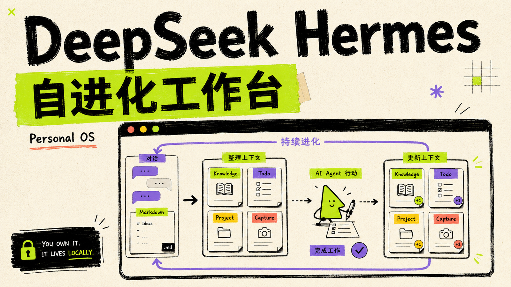

# dsh-personal-os

> 给 DeepSeek Harness 的个人工作台：让 Agent 记住重要内容、接着未完成的事，并把工作沉淀成你自己的资料。



## 它解决什么问题

对话很快，但重要内容容易散：做过的决定找不到、任务做到一半接不上、每次还要重新解释背景。

`dsh-personal-os` 把这些内容放进你自己的本地工作台：

- **今天**：知道现在该做什么、哪些事情卡住了。
- **收件箱**：先收集，再决定是否变成任务、知识或项目。
- **知识**：保存可复用的结论、资料和经验。
- **待办 / 项目**：把下一步和长期目标放在一起。
- **时间线**：回看发生过什么。

它不是另一个聊天窗口，而是 Agent 的长期工作记忆。默认以**完整任务**为整理边界，只有任务真正完成后才生成可确认的整理结果，不会每聊一轮就自动塞一条 Inbox 记录。

## 为什么用

- **内容归你**：数据保存在你选择的本地目录，使用普通 Markdown，可直接打开、编辑和备份。
- **少重复沟通**：Agent 和工作台读同一份上下文，下一次可以从上次停下的地方继续。
- **轻量可撤回**：先预览、再确认；版本历史可选，不会擅自改远端 Git。
- **装好即用**：以 DSH 插件运行，不需要单独维护一套云端账号或数据库。

## 一句话安装

这是已经发布到 npm 的安装包，不需要下载源码。

给 DSH Agent 的一句话：

> 安装 `dsh-personal-os` 插件：`npx @deepseek-ai/dsh plugin --profile web add dsh-personal-os`

安装后重启 web profile：

```bash
npx @deepseek-ai/dsh web
```

## 卸载

```bash
npx @deepseek-ai/dsh plugin --profile web remove dsh-personal-os
```

安装、移除或更新插件后请重启对应 DSH profile。

## 从源码安装（开发者）

```bash
pnpm install --frozen-lockfile
pnpm build
npx @deepseek-ai/dsh plugin --profile web add "$PWD"
npx @deepseek-ai/dsh web
```

插件通过自己的 `dsh.bundle.patch` 接管 Sidebar，不需要也不应该手工修改 Harness profile 配置。

## 当前能力

- Markdown 是唯一真源；启动全量重建、运行时文件监听和 revision-aware 原子保存不依赖 SQLite。
- Capture、Knowledge、Todo、Project 使用稳定 ID 和可编辑模板，Archive 可恢复，Relation 只保存显式边。
- Today、Calendar、Timeline、Search、Project Progress 和 Graph 都是可删除、可重建的派生视图。
- Task Outcome Curation 以完整任务为边界，而不是以一轮对话为边界。“谨慎”模式在任务完成后生成待确认提案，“主动”模式只自动应用高置信度结果，“关闭”模式只响应显式整理。提交、推送、重试和澄清会并入同一任务；自动整理只保存结构化结果与 Session/Task/seq provenance，不复制原始日志，也绝不会自动把低置信度内容写成 Inbox Capture。
- Today 的“继续进行”展示 active、等待回复和阻塞任务，并说明任务边界与状态判断依据；用户可以回到原会话，或在尚未应用结果时保守地拆分、合并任务边界。会话输入区显示 Agent 实际读取过以及 Outcome 准备更新的 Personal Context。
- Version History 默认关闭；启用后仅使用本地 Git checkpoint 与新增 revert commit，不操作远端或分支。
- Vault Import 默认先预检再复制，保留源目录、未知 Frontmatter、Wiki Link、checkbox 和附件。

## 数据边界

- Personal Data Directory 由用户首次启动时选择，并在所有 DSH Workspaces 之间共享。
- 插件配置只记录该目录位置；后续 Domain Fact 将以普通 Markdown 保存在用户选择的目录。
- DSH 的 Session、权限、模型、Workspace、Settings 和 Agent Runtime 继续由 DSH 本身管理。

## 开发验证

```bash
pnpm check
```

该命令运行类型检查、Vitest 测试和 Host/Client 生产构建。打包契约还会用真实 npm tarball 验证运行时入口。

## License

[MIT](LICENSE)
